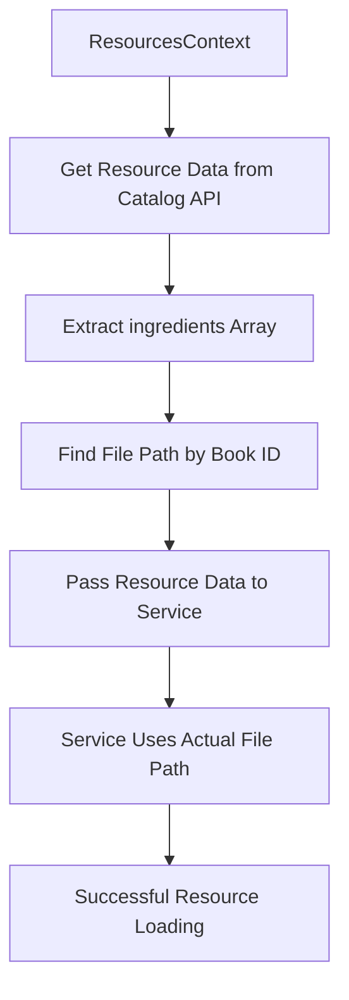

# API-Direct Service Architecture Documentation

## 🚨 CRITICAL: Resource File Path Resolution

**Date Created**: December 2024  
**Status**: MANDATORY ARCHITECTURE PATTERN  
**Priority**: CRITICAL - Prevents 404 errors and broken resource loading

---

## The Problem: Hardcoded File Naming Conventions

### What Went Wrong
Services were using **hardcoded naming conventions** instead of actual file paths from the catalog API:

```javascript
// ❌ WRONG: Hardcoded naming convention
const filePath = `tn_${bookId.toUpperCase()}.tsv`;
// Results in: tn_GEN.tsv (may not exist!)

// ✅ CORRECT: Use ingredients array from catalog API
const ingredient = resourceData.ingredients.find(ing => ing.identifier === bookId);
const filePath = ingredient.path;
// Results in: 01-GEN.tsv (actual file path!)
```

### Impact
- **404 errors** when fetching resources
- **Empty AI Assistant context** - only Translation Words worked
- **Broken user experience** - panels showed data but AI didn't
- **Inconsistent behavior** across different organizations

---

## The Solution: Ingredients-Based File Resolution

### Architecture Overview



### Implementation Pattern

#### 1. Get Resource Data with Ingredients
```javascript
// In ResourcesContext.jsx
const getResourceData = useCallback(async (resourceType, config) => {
  const { resources } = await searchAllResourcesForLanguage(languageId);
  const orgResources = resources[config.organization];
  
  const subjectMap = {
    tn: ['Translation Notes'],
    tq: ['Translation Questions'], 
    tw: ['Translation Words'],
    twl: ['Translation Word Links']
  };

  const resourceData = orgResources.find(res => {
    const subjects = subjectMap[resourceType] || [];
    return subjects.includes(res.subject) && 
           (res.id === config.resourceId || res.name.includes(config.resourceId));
  });

  return resourceData; // Contains ingredients array!
}, [languageId]);
```

#### 2. Enhanced Service Functions
```javascript
// In tnService.js, tqService.js, etc.
export async function getNotesForVerseWithResourceData(
  bookId,
  chapter,
  verse,
  resourceData, // ← Resource data with ingredients!
  languageId = "en"
) {
  let filePath;
  
  // Try to get file path from ingredients array
  if (resourceData.ingredients && Array.isArray(resourceData.ingredients)) {
    const ingredient = resourceData.ingredients.find(ing => ing.identifier === bookId);
    if (ingredient && ingredient.path) {
      filePath = ingredient.path; // ← Actual file path!
      console.log(`✅ Found file path in ingredients: ${filePath}`);
    } else {
      console.warn(`Book ${bookId} not found in ingredients, falling back`);
      filePath = `tn_${bookId.toUpperCase()}.tsv`; // Fallback
    }
  } else {
    filePath = `tn_${bookId.toUpperCase()}.tsv`; // Fallback
  }

  // Use the correct file path
  const tsvContent = await fetchResourceFile(languageId, RESOURCE_ID, filePath, organization);
  // ... rest of processing
}
```

#### 3. ResourcesContext Integration
```javascript
// In ResourcesContext.jsx loadResources()
const tnResourceData = await getResourceData('tn', tnConfig);

let result;
if (tnResourceData) {
  // Use enhanced service with resource data
  result = await getNotesForVerseWithResourceData(
    bookId, chapter, verse, tnResourceData, languageId
  );
} else {
  // Fallback to old service with hardcoded naming
  result = await getNotesForVerse(
    bookId, chapter, verse, tnConfig.organization, languageId
  );
}
```

---

## Mandatory Rules for All Services

### ✅ DO: Use Ingredients Array
1. **Always get resource data** from catalog API first
2. **Check ingredients array** for actual file paths
3. **Use ingredient.path** for file resolution
4. **Provide fallback** to naming conventions
5. **Log the process** for debugging

### ❌ DON'T: Use Hardcoded Naming
1. **Never assume** file naming conventions
2. **Don't hardcode** `tn_GEN.tsv`, `tq_GEN.tsv`, etc.
3. **Don't skip** catalog API resource data
4. **Don't ignore** ingredients array
5. **Don't create** services without resource data support

---

## Service Implementation Checklist

When creating or updating a service:

- [ ] Import catalog service: `import { searchAllResourcesForLanguage } from "../services/catalogService"`
- [ ] Create enhanced function: `getFooWithResourceData(bookId, chapter, verse, resourceData, languageId)`
- [ ] Check ingredients array: `resourceData.ingredients.find(ing => ing.identifier === bookId)`
- [ ] Use actual file path: `ingredient.path`
- [ ] Provide fallback: Hardcoded naming if no ingredients
- [ ] Add logging: Console logs for debugging
- [ ] Export both versions: Enhanced and legacy functions
- [ ] Update ResourcesContext: Use enhanced version with resource data

---

## Debugging Guide

### Console Logs to Look For
```
🔍 Getting resource data for tn: unfoldingWord_en_tn
✅ Found resource data for tn: { id: "tn", subject: "Translation Notes", ingredientsCount: 66 }
🔄 TN Service: Loading with resource data for gen 1:1
✅ TN Service: Found file path in ingredients: 01-GEN.tsv
✅ TN Service: Loaded 45 notes using 01-GEN.tsv
```

### Error Patterns to Avoid
```
❌ Failed to load tn_GEN.tsv for en_tn: Not Found
❌ HTTP 404: Not Found
❌ No resource data provided for Translation Notes
```

---

## Testing Requirements

### Unit Tests Must Cover
1. **Resource data with ingredients** - Test with real catalog API response
2. **File path extraction** - Verify ingredients array usage
3. **Fallback behavior** - Test when ingredients missing
4. **Error handling** - Test when file not found
5. **Cross-organization** - Test with different organizations

### Integration Tests Must Verify
1. **End-to-end loading** - From ResourcesContext to service
2. **AI Assistant context** - Verify resources appear in chat
3. **Panel vs AI sync** - Ensure both show same data
4. **Resource data caching** - Verify catalog API efficiency

---

## Version History

| Version | Date | Change | Impact |
|---------|------|--------|--------|
| 1.0 | Dec 2024 | Initial hardcoded naming | ❌ 404 errors, broken AI |
| 2.0 | Dec 2024 | Ingredients-based resolution | ✅ Proper file paths, working AI |

---

## Related Documentation
- [NO-MANIFESTS-API-DIRECT.md](./NO-MANIFESTS-API-DIRECT.md) - Overall API-direct architecture
- [catalogService.js](../src/services/catalogService.js) - Resource data fetching
- [ResourcesContext.jsx](../src/context/ResourcesContext.jsx) - Resource loading coordination

---

**⚠️ REMEMBER: Never assume file naming conventions. Always use the catalog API's ingredients array for actual file paths!** 

## 🛡️ Fallback Architecture Pattern

### Multi-Layer Resilience Strategy

The Translation Helps services implement a sophisticated **3-tier fallback architecture** that ensures maximum compatibility and reliability:

```javascript
// TIER 1: Ingredients-Based Resolution (Primary)
const ingredient = resourceData?.ingredients?.find(ing => ing.identifier === bookId);
if (ingredient && ingredient.path) {
  filePath = ingredient.path; // Use actual file path from catalog API
  console.log(`✅ Using ingredients path: ${filePath}`);
}

// TIER 2: Naming Convention Fallback (Secondary)  
else {
  filePath = `tn_${bookId.toUpperCase()}.tsv`; // Standard naming pattern
  console.warn(`⚠️ Falling back to naming convention: ${filePath}`);
}

// TIER 3: Error Handling (Tertiary)
try {
  const content = await fetchResourceFile(languageId, resourceType, filePath, organization);
  return parseContent(content);
} catch (error) {
  console.error(`❌ All fallbacks failed: ${error.message}`);
  return []; // Graceful degradation - return empty array
}
```

### Service-Level Fallback Implementation

Each service implements dual functions for maximum compatibility:

#### Enhanced Functions (Ingredients-Based)
```javascript
// Primary: Use resource data with ingredients array
export async function getNotesForVerseWithResourceData(bookId, chapter, verse, resourceData, languageId) {
  // Sophisticated file path resolution with multiple fallback layers
  let filePath;
  
  if (resourceData?.ingredients?.length > 0) {
    const ingredient = resourceData.ingredients.find(ing => ing.identifier === bookId);
    filePath = ingredient?.path || `tn_${bookId.toUpperCase()}.tsv`;
  } else {
    filePath = `tn_${bookId.toUpperCase()}.tsv`;
  }
  
  // Continue with file fetching...
}
```

#### Legacy Functions (Naming Convention)
```javascript
// Fallback: Use standard naming patterns
export async function getNotesForVerse(bookId, chapter, verse, organization, languageId) {
  const filePath = `tn_${bookId.toUpperCase()}.tsv`; // Always use naming convention
  // Continue with file fetching...
}
```

### Context-Level Orchestration

The ResourcesContext orchestrates the fallback strategy:

```javascript
// Try enhanced service first
const resourceData = await getResourceData('tn', tnConfig);

let result;
if (resourceData) {
  // PRIMARY: Use ingredients-based service
  result = await getNotesForVerseWithResourceData(bookId, chapter, verse, resourceData, languageId);
  console.log(`✅ Used ingredients-based resolution`);
} else {
  // FALLBACK: Use naming convention service  
  console.warn(`⚠️ No resource data, using naming convention fallback`);
  result = await getNotesForVerse(bookId, chapter, verse, organization, languageId);
}
```

### Fallback Scenarios Handled

| Scenario | Primary Response | Fallback Response | Final Response |
|----------|------------------|-------------------|----------------|
| **Full ingredients available** | ✅ Use ingredient.path | N/A | Success |
| **Empty ingredients array** | ⚠️ No ingredients found | ✅ Use naming convention | Success |
| **No resource data** | ⚠️ API call failed | ✅ Use legacy service | Success |
| **File not found (ingredients)** | ❌ 404 on ingredient path | ✅ Try naming convention | Success/Failure |
| **File not found (naming)** | ❌ 404 on standard name | ❌ Return empty array | Graceful degradation |
| **Network failure** | ❌ Network error | ❌ Return empty array | Graceful degradation |

### Logging & Transparency

The fallback system provides comprehensive logging for debugging:

```javascript
// Ingredients resolution logging
console.log(`🔍 TN Service: Checking ingredients for ${bookId}`);
if (ingredient) {
  console.log(`✅ TN Service: Found file path in ingredients: ${ingredient.path}`);
} else {
  console.warn(`⚠️ TN Service: Book ${bookId} not found in ingredients, using fallback`);
}

// Resource data availability logging
if (resourceData) {
  console.log(`✅ ResourcesContext: Using enhanced service with resource data`);
} else {
  console.warn(`⚠️ ResourcesContext: No resource data, using legacy service`);
}

// Final result logging
console.log(`✅ TN Service: Loaded ${result.length} notes using ${filePath}`);
```

### Benefits of This Architecture

1. **🔄 Seamless Migration**: New ingredients-based approach works alongside legacy naming
2. **🛡️ Maximum Reliability**: Multiple fallback layers prevent total failure
3. **📊 Transparent Operation**: Comprehensive logging shows which path was used
4. **🔧 Easy Debugging**: Clear logging patterns help identify issues quickly
5. **⚡ Performance Optimized**: Caches resource data to avoid repeated API calls
6. **🎯 Graceful Degradation**: Always returns valid data structure, even on failure

### Future Evolution Path

This architecture enables smooth evolution:

```javascript
// Phase 1: Dual implementation (current)
if (resourceData) {
  return await enhancedService(resourceData);
} else {
  return await legacyService();
}

// Phase 2: Ingredients-first with warning
if (resourceData) {
  return await enhancedService(resourceData);
} else {
  console.warn("Legacy naming convention deprecated - update resource configuration");
  return await legacyService();
}

// Phase 3: Ingredients-only (future)
if (!resourceData) {
  throw new Error("Resource data required - legacy naming no longer supported");
}
return await enhancedService(resourceData);
```

This fallback architecture ensures that the Translation Helps system remains robust and reliable while enabling seamless evolution toward the ingredients-based future.

---

## 📊 Implementation Status

### ✅ COMPLETE: All Services Enhanced with Fallback Architecture

| Service | Enhanced Function | Legacy Function | Fallback Strategy | Status |
|---------|------------------|-----------------|-------------------|---------|
| **Scripture** | `fetchBookWithFallback()` | `fetchBook()` | 3-tier fallback + double-fallback | ✅ Complete |
| **Translation Notes** | `getNotesForVerseWithResourceData()` | `getNotesForVerse()` | 3-tier fallback | ✅ Complete |
| **Translation Questions** | `getQuestionsForVerseWithResourceData()` | `getQuestionsForVerse()` | 3-tier fallback | ✅ Complete |
| **Translation Word Links** | `getLinksForVerseWithResourceData()` | `getLinksForVerse()` | 3-tier fallback | ✅ Complete |
| **Translation Words** | Uses RC URIs from TWL | N/A | Inherits TWL reliability | ✅ Complete |

### Enhanced Service Architecture Summary

```javascript
// All services now implement this pattern:

// PRIMARY: Enhanced service with resource data
if (resourceData) {
  result = await getServiceWithResourceData(bookId, chapter, verse, resourceData, languageId);
  console.log(`✅ Used ingredients-based resolution`);
}

// FALLBACK: Legacy service with naming conventions  
else {
  console.warn(`⚠️ No resource data, using naming convention fallback`);
  result = await getLegacyService(bookId, chapter, verse, organization, languageId);
}

// GRACEFUL DEGRADATION: Always return valid structure
return result || [];
```

### Scripture Service: Enhanced Double-Fallback Architecture

The Scripture service implements the most sophisticated fallback system with **4 distinct fallback layers**:

```javascript
// TIER 1: Ingredients-based resolution (Primary)
if (resourceData?.ingredients) {
  const ingredient = resourceData.ingredients.find(ing => ing.identifier === bookId);
  if (ingredient?.path) {
    filePath = ingredient.path.replace("./", "");
    console.log(`✅ Using ingredients path: ${filePath}`);
  }
}

// TIER 2: Naming convention fallback (Secondary)
if (!filePath) {
  filePath = `${bookId.toUpperCase()}.usfm`;
  console.warn(`⚠️ Using naming convention: ${filePath}`);
}

// TIER 3: First fetch attempt (Tertiary)
try {
  const usfm = await fetchResourceFile(languageId, resourceId, filePath, organization);
  return usfm;
} catch (fetchError) {
  
  // TIER 4: Double-fallback for ingredients failures (Quaternary)
  if (resourceData?.ingredients && filePath !== `${bookId.toUpperCase()}.usfm`) {
    console.warn(`⚠️ Ingredients path failed, trying naming convention as final fallback`);
    const fallbackPath = `${bookId.toUpperCase()}.usfm`;
    
    try {
      const fallbackUsfm = await fetchResourceFile(languageId, resourceId, fallbackPath, organization);
      return fallbackUsfm;
    } catch (fallbackError) {
      console.error(`❌ Both ingredients and naming convention failed`);
    }
  }
  
  throw fetchError; // All fallbacks exhausted
}
```

This **double-fallback** architecture ensures Scripture loading succeeds even when:
- Ingredients array contains incorrect file paths
- Network issues affect specific files
- Resource organization changes file naming conventions
- API responses are incomplete or malformed

--- 