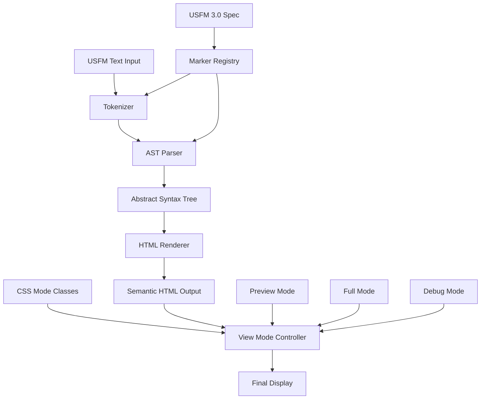

# USFM 3.0 Semantic Rendering

## Overview

This document describes the implementation of a comprehensive USFM 3.0 semantic rendering system that preserves all markup information while providing clean preview modes for end users.

## Rationale

The current USFM renderer strips all markup to display only clean text. However, for translation work, it's valuable to:

1. **Preserve all original information** - Every USFM marker and attribute is maintained
2. **Enable semantic navigation** - Users can understand the structure and meaning
3. **Support multiple viewing modes** - Toggle between full markup, preview, and debug modes
4. **Maintain accessibility** - Screen readers can understand the document structure

## Architecture



## USFM 3.0 Complete Specification Coverage

### 1. Identification and Headers

| Marker   | Description             | Type      | End Marker |
| -------- | ----------------------- | --------- | ---------- |
| `\id`    | File identification     | Paragraph | No         |
| `\usfm`  | USFM version            | Paragraph | No         |
| `\ide`   | File encoding           | Paragraph | No         |
| `\h`     | Running header          | Paragraph | No         |
| `\toc1`  | Long table of contents  | Paragraph | No         |
| `\toc2`  | Short table of contents | Paragraph | No         |
| `\toc3`  | Book abbreviation       | Paragraph | No         |
| `\toca1` | Alternative TOC 1       | Paragraph | No         |
| `\toca2` | Alternative TOC 2       | Paragraph | No         |
| `\toca3` | Alternative TOC 3       | Paragraph | No         |

### 2. Main Titles and Headings

| Marker    | Description                      | Type      | End Marker |
| --------- | -------------------------------- | --------- | ---------- |
| `\mt1-4`  | Main title levels 1-4            | Paragraph | No         |
| `\mte1-2` | Main title at ending levels 1-2  | Paragraph | No         |
| `\ms1-3`  | Major section heading levels 1-3 | Paragraph | No         |
| `\mr`     | Major section reference range    | Paragraph | No         |

### 3. Chapter and Verse

| Marker | Description                 | Type      | End Marker |
| ------ | --------------------------- | --------- | ---------- |
| `\c`   | Chapter number              | Milestone | No         |
| `\ca`  | Alternate chapter number    | Character | `\ca*`     |
| `\cl`  | Chapter label               | Paragraph | No         |
| `\cd`  | Chapter description         | Paragraph | No         |
| `\cp`  | Published chapter character | Paragraph | No         |
| `\v`   | Verse number                | Milestone | No         |
| `\va`  | Alternate verse number      | Character | `\va*`     |
| `\vp`  | Published verse character   | Character | `\vp*`     |

### 4. Paragraphs

| Marker   | Description                      | Type      | End Marker |
| -------- | -------------------------------- | --------- | ---------- |
| `\p`     | Normal paragraph                 | Paragraph | No         |
| `\m`     | Margin paragraph                 | Paragraph | No         |
| `\po`    | Opening of an epistle            | Paragraph | No         |
| `\pr`    | Right-aligned paragraph          | Paragraph | No         |
| `\cls`   | Closure of an epistle            | Paragraph | No         |
| `\pmo`   | Embedded text opening            | Paragraph | No         |
| `\pm`    | Embedded text paragraph          | Paragraph | No         |
| `\pmc`   | Embedded text closing            | Paragraph | No         |
| `\pmr`   | Embedded text refrain            | Paragraph | No         |
| `\pi1-3` | Indented paragraph levels 1-3    | Paragraph | No         |
| `\mi`    | Indented flush left paragraph    | Paragraph | No         |
| `\nb`    | No break with previous paragraph | Paragraph | No         |
| `\pc`    | Centered paragraph               | Paragraph | No         |
| `\ph1-3` | Hanging paragraph levels 1-3     | Paragraph | No         |
| `\phi`   | Indented hanging paragraph       | Paragraph | No         |

### 5. Poetry

| Marker   | Description                          | Type      | End Marker |
| -------- | ------------------------------------ | --------- | ---------- |
| `\q1-4`  | Poetic line levels 1-4               | Paragraph | No         |
| `\qr`    | Right-aligned poetic line            | Paragraph | No         |
| `\qc`    | Centered poetic line                 | Paragraph | No         |
| `\qs`    | Selah                                | Character | `\qs*`     |
| `\qa`    | Acrostic heading                     | Paragraph | No         |
| `\qac`   | Acrostic character                   | Character | `\qac*`    |
| `\qm1-3` | Embedded text poetic line levels 1-3 | Paragraph | No         |
| `\qd`    | Hebrew note                          | Paragraph | No         |

### 6. Lists

| Marker    | Description                    | Type      | End Marker |
| --------- | ------------------------------ | --------- | ---------- |
| `\li1-4`  | List entry levels 1-4          | Paragraph | No         |
| `\lf`     | List footer                    | Paragraph | No         |
| `\lim1-4` | Embedded list entry levels 1-4 | Paragraph | No         |
| `\litl`   | List entry total               | Paragraph | No         |
| `\lik`    | Structured list entry          | Paragraph | No         |
| `\liv1-4` | List entry verse levels 1-4    | Paragraph | No         |

### 7. Section Headings

| Marker   | Description                  | Type      | End Marker |
| -------- | ---------------------------- | --------- | ---------- |
| `\s1-4`  | Section heading levels 1-4   | Paragraph | No         |
| `\sr`    | Section reference range      | Paragraph | No         |
| `\r`     | Parallel reference           | Paragraph | No         |
| `\d`     | Descriptive title            | Paragraph | No         |
| `\sp`    | Speaker identification       | Paragraph | No         |
| `\sd1-4` | Semantic division levels 1-4 | Paragraph | No         |

### 8. Character Formatting

| Marker | Description              | Type      | End Marker |
| ------ | ------------------------ | --------- | ---------- |
| `\add` | Translator's addition    | Character | `\add*`    |
| `\bk`  | Book name                | Character | `\bk*`     |
| `\dc`  | Deuterocanonical content | Character | `\dc*`     |
| `\k`   | Keyword                  | Character | `\k*`      |
| `\lit` | Liturgical note          | Character | `\lit*`    |
| `\nd`  | Name of deity            | Character | `\nd*`     |
| `\ord` | Ordinal number           | Character | `\ord*`    |
| `\pn`  | Proper name              | Character | `\pn*`     |
| `\png` | Geographic name          | Character | `\png*`    |
| `\qt`  | Quoted text              | Character | `\qt*`     |
| `\sig` | Signature                | Character | `\sig*`    |
| `\sls` | Language switch          | Character | `\sls*`    |
| `\tl`  | Transliterated word      | Character | `\tl*`     |
| `\wj`  | Words of Jesus           | Character | `\wj*`     |

### 9. Word-level Markup

| Marker    | Description     | Type      | End Marker |
| --------- | --------------- | --------- | ---------- |
| `\w`      | Word entry      | Character | `\w*`      |
| `\rb`     | Ruby base text  | Character | `\rb*`     |
| `\rt`     | Ruby text       | Character | `\rt*`     |
| `\zaln-s` | Alignment start | Milestone | No         |
| `\zaln-e` | Alignment end   | Milestone | No         |

### 10. Footnotes

| Marker | Description                       | Type      | End Marker |
| ------ | --------------------------------- | --------- | ---------- |
| `\f`   | Footnote                          | Note      | `\f*`      |
| `\fe`  | Endnote                           | Note      | `\fe*`     |
| `\fr`  | Footnote reference                | Character | No         |
| `\fk`  | Footnote keyword                  | Character | No         |
| `\fq`  | Footnote quotation                | Character | No         |
| `\fqa` | Footnote alternate translation    | Character | No         |
| `\fl`  | Footnote label                    | Character | No         |
| `\fw`  | Footnote witness                  | Character | No         |
| `\fp`  | Footnote paragraph                | Paragraph | No         |
| `\fv`  | Footnote verse number             | Character | No         |
| `\ft`  | Footnote text                     | Character | No         |
| `\fdc` | Footnote deuterocanonical content | Character | `\fdc*`    |
| `\fm`  | Footnote mark                     | Character | No         |

### 11. Cross References

| Marker | Description                               | Type      | End Marker |
| ------ | ----------------------------------------- | --------- | ---------- |
| `\x`   | Cross reference                           | Note      | `\x*`      |
| `\xo`  | Cross reference origin                    | Character | No         |
| `\xk`  | Cross reference keyword                   | Character | No         |
| `\xq`  | Cross reference quotation                 | Character | No         |
| `\xt`  | Cross reference target reference          | Character | No         |
| `\xta` | Cross reference target reference (Targum) | Character | No         |
| `\xop` | Cross reference published origin          | Character | No         |
| `\xot` | Cross reference origin text               | Character | No         |
| `\xnt` | Cross reference note text                 | Character | No         |
| `\xdc` | Cross reference deuterocanonical content  | Character | `\xdc*`    |

### 12. Tables

| Marker    | Description                   | Type      | End Marker |
| --------- | ----------------------------- | --------- | ---------- |
| `\tr`     | Table row                     | Paragraph | No         |
| `\th1-5`  | Table header cells 1-5        | Character | No         |
| `\tc1-5`  | Table cells 1-5               | Character | No         |
| `\tcr1-5` | Right-aligned table cells 1-5 | Character | No         |

### 13. Special Features

| Marker       | Description         | Type      | End Marker |
| ------------ | ------------------- | --------- | ---------- |
| `\fig`       | Figure/illustration | Milestone | `\fig*`    |
| `\cat`       | Category entry      | Paragraph | No         |
| `\esb`       | Sidebar             | Note      | `\esbe`    |
| `\milestone` | Generic milestone   | Milestone | No         |

## Dual Purpose Requirements

### CRITICAL: Two Independent but Compatible Requirements

This USFM renderer must simultaneously satisfy two distinct purposes that work together but serve different needs:

#### 1. Preview Mode: Clean Bible Text Display

**Purpose**: Present readable scripture text to end users as they would see in a printed Bible.

**Requirements**:

- Visual output shows ONLY the readable text content (verse text, chapter/verse numbers)
- ALL USFM markers, attributes, and technical markup are visually hidden via CSS
- Typography and layout match traditional Bible formatting conventions
- User sees: "¹Paul, a servant of God and an apostle of Jesus Christ..."
- Mobile-optimized, touch-friendly verse navigation
- Consistent with other resource panels in the application

#### 2. Full Character Preservation: Lossless USFM Storage

**Purpose**: Maintain perfect fidelity to original USFM source for programmatic access.

**Requirements**:

- `.textContent` property returns the EXACT original USFM input character-for-character
- Every marker, attribute, whitespace character, and punctuation mark preserved in DOM
- No information loss, normalization, or reformatting of any kind
- Programmatic access can reconstruct original USFM perfectly
- User gets: `\v 1 \zaln-s |x-strong="G39720"\*\w Paul\w*\zaln-e\*...`

### How Both Requirements Work Together

The solution uses **CSS-controlled visibility** to satisfy both needs:

```html
<!-- DOM contains ALL original USFM characters -->
<usfm class="preview">
  <span class="verse-marker">\v </span>
  <span class="verse-number">1</span>
  <span class="zaln-start">\zaln-s |x-strong="G39720"\*</span>
  <span class="word-start">\w </span>
  Paul
  <span class="word-end">\w*</span>
  <span class="zaln-end">\zaln-e\*</span>
</usfm>
```

```css
/* Preview mode: Hide markers, show only content */
.usfm.preview .verse-marker,
.usfm.preview .zaln-start,
.usfm.preview .zaln-end,
.usfm.preview .word-start,
.usfm.preview .word-end {
  display: none; /* Hidden from view but still in textContent */
}

.usfm.preview .verse-number {
  display: inline; /* Visible in preview */
}
```

### Validation Tests

Both requirements must pass these tests:

```javascript
// Test 1: Preview mode visual output
const rendered = parser.renderToHTML(usfmInput, "preview");
const visibleText = getVisibleText(rendered); // What user sees
assert(visibleText === "1 Paul, a servant of God...", "Clean preview text");

// Test 2: Full character preservation
const domContent = rendered.textContent; // What .textContent returns
assert(domContent === usfmInput, "Perfect USFM preservation");

// Test 3: Round-trip fidelity
assert(domContent.length === usfmInput.length, "No character loss");
assert(domContent === usfmInput, "Character-for-character match");
```

### Design Implications

1. **DOM Structure**: ALL USFM characters must exist as text nodes in the DOM
2. **CSS Strategy**: Use `display: none` to hide elements, never remove from DOM
3. **HTML Attributes**: Cannot store USFM data in attributes (not part of textContent)
4. **Whitespace**: Must preserve exactly as in original (no normalization)
5. **Special Characters**: HTML-escape but preserve character count and meaning

### Reversibility Guarantee

The system MUST guarantee this fundamental property:

```javascript
// Perfect round-trip preservation
const originalUSFM = input;
const renderedHTML = renderToHTML(originalUSFM);
const recoveredUSFM = renderedHTML.textContent;

assert(originalUSFM === recoveredUSFM, "Lossless USFM preservation");
```

This dual-purpose architecture ensures the component can serve both human readers (clean preview) and programmatic consumers (perfect preservation) without compromise.

## Parser and Rendering Invariants (2025-06-14)

### Section Headings (`\s`, `\s1`, etc.)

- Rendered as `<heading class="section-heading">...</heading>`.
- Section headings must always self-close before any new block-level marker (such as `\p`, `\v`, `\s`, `\c`, etc.) is encountered.
- Section headings must never nest or contain block-level elements (paragraphs, verses, other headings, etc.).
- The parser enforces this by calling `closeAllSectionHeadings()` before opening any block-level marker.

### Poetry Lines (`\q`, `\q1`, etc.)

- Poetry lines are always closed before a new verse or poetry line is opened.
- Poetry lines must never contain verses or other poetry lines.
- The parser enforces this by calling `closeAllPoetryLines()` before opening a new verse or poetry line.

### Block-level Markers

- All block-level markers (`\p`, `\v`, `\c`, `\s`, etc.) are siblings in the DOM, never nested within each other except as allowed by USFM (e.g., poetry lines inside verses).
- The parser closes all open block-level elements as needed to maintain this invariant.

### Special Markers

- The `"\ts ... \ts\*"` marker pair is rendered as `<heading class="section-heading"><marker class="ts">\ts</marker>Section Heading</heading>`.
  - The start marker `"\ts"` is rendered as `<marker class="ts">\ts</marker>`.
  - The end marker **`"\ts\*"`** (the literal marker) is **not rendered at all**—it simply closes the heading, with no `<marker>*</marker>` or asterisk in the output.
  - **It is a parser invariant that after `"\ts\*"`, the heading is always closed and no block-level element (paragraph, verse, heading, etc.) can ever be nested inside.**
  - **If any block-level marker is encountered while a heading is open, the heading must be closed before the new block-level element is opened.**
  - No stray asterisks, strikethroughs, or extra tags are rendered for section headings.
  - This is a special case: the parser must never emit a marker or asterisk for `"\ts\*"` and must close the heading immediately after.
  - **USFM input:**
    ```
    \ts Section Heading\ts\*
    ```
  - **HTML output:**
    ```html
    <heading class="section-heading"><marker class="ts">\ts</marker>Section Heading</heading>
    ```
  - This rule is enforced in the parser and must not be changed without updating this documentation.
  - **WARNING:** Any future parser or renderer must enforce this invariant for `"\ts\*"` and section headings, and this documentation must be updated if the rule changes.

### CSS and Styling

- Section headings are styled as h2 using `.section-heading` in the CSS module.
- The parser always emits the correct class for section headings.

### Documentation and Code Sync

- Any changes to these invariants must be reflected in both the parser code and this documentation.
- This section must be updated if the parser or renderer logic changes.

---

## HTML Output Format

Based on the test case, each USFM element is rendered as semantic HTML:

```html
<usfm class="preview">
  <v>
    <marker>\v </marker><number>1</number>
    <zaln>
      <marker class="zaln-s">\zaln-s </marker>
      <attributes>|x-strong="G39720" x-lemma="Παῦλος"</attributes>
      <marker class="*">\*</marker>
      <word>
        <marker class="w">\w </marker>
        <content>Paul</content>
        <attributes>|x-occurrence="1" x-occurrences="1"</attributes>
        <marker class="w*">\w*</marker>
      </word>
      <marker class="zaln-e">\zaln-e</marker>
      <marker class="*">\*</marker>
    </zaln>
  </v>
</usfm>
```

**Note**: The `.textContent` of the above HTML must equal the original USFM input exactly.

## CSS Classes and View Modes

### View Mode Classes

- `.preview` - Hide all markers and attributes, show only content
- `.full` - Show everything including markers and attributes
- `.debug` - Highlight different marker types with colors

### Element Classes

- `.marker` - USFM marker elements (`\v`, `\p`, etc.)
- `.attributes` - Pipe-separated attribute values
- `.content` - Actual text content
- `.number` - Chapter/verse numbers
- `.[marker-name]` - Specific marker classes (`.verse`, `.chapter`, etc.)

## Preview Mode Design Language

The preview mode is designed to mimic a printed Bible aesthetic while maximizing screen real estate and maintaining excellent mobile UX.

### Design Principles

1. **Content Density** - Minimize margins and whitespace to show more content
2. **Biblical Typography** - Use serif fonts and traditional Bible formatting
3. **Consistent Sizing** - Match font sizes with other resources (14px base)
4. **Touch-Friendly** - Maintain 48px minimum touch targets
5. **Readability** - Preserve traditional Bible layout patterns

### Typography Specifications

```css
/* Base text matches other resources */
.usfm.preview {
  font-family: Georgia, "Times New Roman", serif; /* Bible-like serif */
  font-size: var(--font-size-md); /* 14px - same as other content */
  line-height: var(--line-height-normal); /* 1.4 - readable but compact */
  text-align: justify; /* Traditional Bible justification */
}

/* Verse numbers - subtle but findable */
.usfm.preview .v .number {
  font-size: var(--font-size-sm); /* 13px */
  font-weight: var(--font-weight-semibold);
  color: var(--color-text-light); /* Muted for less visual weight */
  vertical-align: super;
  margin-right: var(--spacing-1); /* 4px - minimal space */
}

/* Chapter numbers - distinctive but not overwhelming */
.usfm.preview .c .number {
  font-size: var(--font-size-xl); /* 16px - only slightly larger */
  font-weight: var(--font-weight-bold);
  float: left; /* Traditional drop-cap style */
  margin-right: var(--spacing-2); /* 8px */
}
```

### Layout Specifications

```css
/* Mobile-optimized container */
.usfm.preview {
  max-width: 100%;
  padding: var(--spacing-2); /* 8px - minimal padding */
}

/* Paragraph formatting */
.usfm.preview p {
  margin: 0 0 var(--spacing-2) 0; /* Only bottom margin, 8px */
  text-indent: 1em; /* First line indent for continuation */
}

/* First paragraph after heading - no indent */
.usfm.preview h1 + p,
.usfm.preview h2 + p,
.usfm.preview h3 + p,
.usfm.preview .c + p {
  text-indent: 0;
}

/* Touch-friendly verse selection */
.usfm.preview .v {
  min-height: var(--verse-min-height); /* 48px for touch targets */
  padding: var(--spacing-1) 0; /* Minimal vertical padding */
  cursor: pointer;
}

/* Selected verse highlight */
.usfm.preview .v.selected {
  background-color: var(--color-verse-background-selected);
  margin-left: calc(-1 * var(--spacing-2));
  margin-right: calc(-1 * var(--spacing-2));
  padding-left: var(--spacing-2);
  padding-right: var(--spacing-2);
}
```

### Section Headings

```css
/* Section headings - minimal but clear */
.usfm.preview .s1,
.usfm.preview .s2 {
  font-size: var(--font-size-md); /* Same as content */
  font-weight: var(--font-weight-semibold);
  font-style: italic; /* Traditional Bible style */
  margin: var(--spacing-3) 0 var(--spacing-1) 0; /* 12px top, 4px bottom */
  text-align: center;
}
```

### Poetry Formatting

```css
/* Poetry lines with minimal indentation */
.usfm.preview .q1 {
  padding-left: var(--spacing-3);
} /* 12px */
.usfm.preview .q2 {
  padding-left: var(--spacing-4);
} /* 16px */
.usfm.preview .q3 {
  padding-left: var(--spacing-5);
} /* 20px */

/* No additional margins between poetry lines */
.usfm.preview .q1,
.usfm.preview .q2,
.usfm.preview .q3 {
  margin: 0;
  line-height: var(--line-height-tight); /* 1.3 for poetry */
}
```

### Content Visibility

```css
/* Hide all technical markers in preview mode */
.usfm.preview .marker,
.usfm.preview .attributes {
  display: none;
}

/* Show only actual content */
.usfm.preview .content,
.usfm.preview .number {
  display: inline;
}

/* Special handling for words of Jesus */
.usfm.preview .wj .content {
  color: #b91c1c; /* Traditional red letter */
}
```

### Visual Example

```
┌─────────────────────────────────┐
│ Chapter 1                       │ ← 16px bold, minimal top margin
│                                 │
│ ¹Paul, a servant of God and     │ ← 14px content, 13px verse numbers
│ an apostle of Jesus Christ,     │   justified text, serif font
│ for the sake of the faith of    │
│ God's elect and their           │
│ knowledge of the truth,         │
│                                 │
│      The Promise of Eternal Life│ ← Section heading
│                                 │   14px italic centered
│ ²which accords with godliness,  │
│ in hope of eternal life, which  │
│ God, who never lies, promised   │
│ before the ages began           │
└─────────────────────────────────┘
  ↑                             ↑
  8px padding                   8px
```

This design maximizes content density while maintaining the traditional Bible reading experience and ensuring excellent mobile usability.

## Performance Considerations

1. **Caching** - Parsed ASTs are cached to avoid re-parsing
2. **Incremental parsing** - Only parse visible chapters
3. **Memory management** - Clean old cache entries
4. **Lazy rendering** - Render HTML on demand

## Testing Strategy

1. **Unit tests** for each parser component
2. **Integration tests** with full USFM documents
3. **Performance benchmarks** for large documents
4. **Visual regression tests** for HTML output
5. **Accessibility tests** for screen readers

## Migration Path

1. **Phase 1** - Implement new parser alongside existing renderer
2. **Phase 2** - Add feature flags to toggle between renderers
3. **Phase 3** - Migrate components to use new renderer
4. **Phase 4** - Remove old renderer after validation

## API Reference

### USFMParser

```javascript
class USFMParser {
  constructor(options = {})
  parse(usfmText: string): USFMASTNode
  parseChapter(usfmText: string, chapter: number): USFMASTNode[]
}
```

### USFMRenderer

```javascript
class USFMRenderer {
  constructor(options = {})
  renderToHTML(ast: USFMASTNode, mode: 'preview' | 'full' | 'debug'): string
  renderChapter(verses: USFMASTNode[], mode: string): string
}
```

### React Component

```javascript
<USFMSemanticRenderer
  usfm={usfmText}
  chapter={chapterNumber}
  mode='preview'
  onVerseClick={handleVerseClick}
  selectedVerse={verseNumber}
/>
```

This comprehensive approach ensures full USFM 3.0 compatibility while providing flexible viewing options for different user needs.
